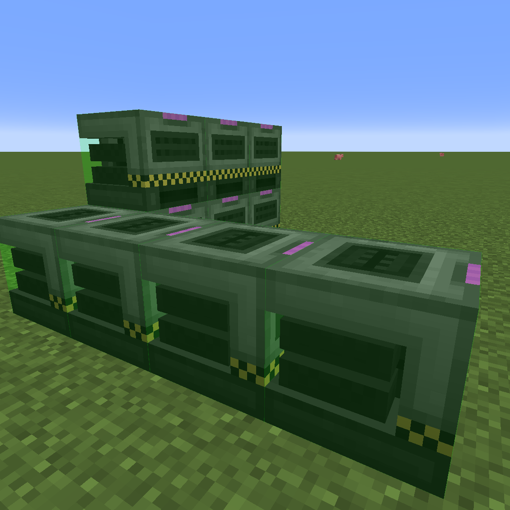

---
item_ids:
  - mekanism_card:mass_upgrade_configurator
categories:
  - Tools
navigation:
  title: Mass Upgrade Configurator
  icon: mekanism_card:mass_upgrade_configurator
  parent: tools.md
  position: 1
---

# Mass Upgrade Configurator

<ItemImage id="mekanism_card:mass_upgrade_configurator" />

The Mass Upgrade Configurator is a powerful tool that allows you to batch install or remove upgrades on multiple Mekanism machines at once.

<RecipeFor id="mekanism_card:mass_upgrade_configurator" />

## Selecting Upgrade

Before using the tool, you need to have upgrade modules in your inventory or in a bound AE2/QIO network.

The tool automatically detects upgrade modules from your inventory first, then from AE2, then from QIO. The item tooltip displays the current inventory-selected upgrade type.

## Network Storage

The configurator can pull upgrade modules from a bound AE2 network or QIO frequency.

- AE2: link the item in a Wireless Access Point.
- QIO: sneak + right-click a QIO block with a selected frequency.
- Consumption priority: inventory, AE2, then QIO.

## Modes

The configurator has two modes:

- Install Mode: installs upgrades on machines.
- Remove Mode: removes upgrades from machines.

Right-click in air to switch between modes.

## Radius Mode

In Radius Mode:

- Sneak + right-click machine: apply the operation to all adjacent machines.
- Right-click air: switch install/remove mode.
- Sneak + right-click air: toggle selection mode.

## Selection Mode

In Selection Mode:

- Sneak + right-click: set the first or second corner of the selection.
- Right-click: execute the batch operation on all machines in the selection.

Select two corners to define a cubic area, then right-click a machine to execute.

## Middle-Click Shortcut

- Middle-click a machine: automatically install all supported upgrade modules on the machine (each to max capacity).
- Middle-click in Radius Mode: batch install all supported upgrades on all adjacent machines.
- Middle-click in Selection Mode: batch install all supported upgrades on all machines in the selection area.

